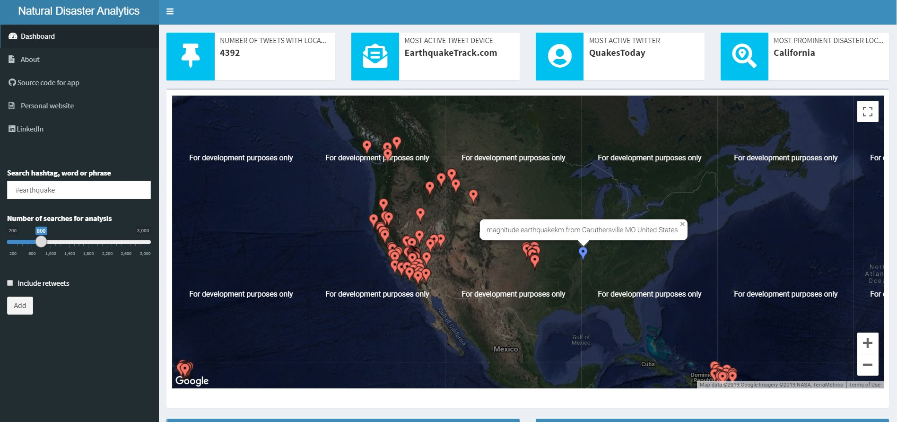

# Rshiny app for tracking natural disasters using live Twitter api data
An Rshiny data visualization dashboard for tracking natural disasters using the Twitter API

This dashboard was created using the Rshiny package, with the purpose of visualizing natural disasters through tweets. [Shiny dashboard](https://rstudio.github.io/shinydashboard/structure.html) was used in creating the dashboard, while [Googlevis R package](https://github.com/mages/googleVis) and [Plotly](https://plot.ly) and [Wordcloud](https://cran.r-project.org/web/packages/wordcloud/wordcloud.pdf) were used for creating the highly interactive charts in the app. The first few charts which show up when the dashboard is loaded are placeholder charts, necessary to maintain the structure of the app before input is accepted. Moreso, the [rtweet R package](https://cran.r-project.org/web/packages/rtweet/rtweet.pdf) was used for accessing data from the Twitter api using a previously setup api key and id. 

For a complete demo of the app, visit [here](https://fabianokafor369.shinyapps.io/disasterapp/#).

